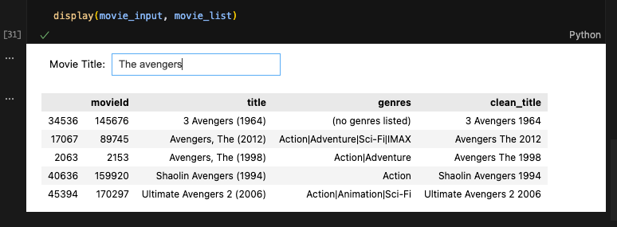
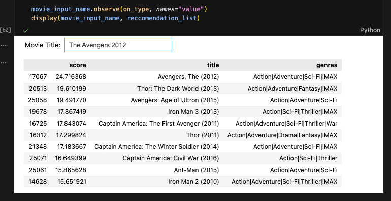

# Film Recommendation Project

This project is a simple film recommendation system based on user ratings.

## About the Data

The data used in this project is a subset of the [MovieLens 25M dataset](https://grouplens.org/datasets/movielens/25m/). We are using two files from this dataset: `movies.csv` and `ratings.csv`.

### Movies Data (`movies.csv`)

Movie information is contained in `movies.csv`. Each line of this file after the header row represents one movie, and has the following format:

`movieId,title,genres`

-   **movieId**: A unique identifier for each movie.
-   **title**: The movie title, including the year of release.
-   **genres**: A pipe-separated list of genres.

### Ratings Data (`ratings.csv`)

All user ratings are contained in `ratings.csv`. Each line of this file represents one rating of one movie by one user, and has the following format:

`userId,movieId,rating,timestamp`

-   **userId**: A unique identifier for each user.
-   **movieId**: The identifier for the movie being rated.
-   **rating**: The rating given to the movie, on a 5-star scale with half-star increments.
-   **timestamp**: The time the rating was given.

## Movie Search Widget

To easily find movies, an interactive search widget was built. This widget uses a Term Frequency-Inverse Document Frequency (TF-IDF) vectorizer to convert movie titles into a numerical representation. When a user types a movie title, the widget calculates the cosine similarity between the input title and the movie titles in the dataset, displaying the top 5 most similar movies.

## Recommendation Engine

The core of this project is the recommendation engine, which uses a collaborative filtering approach. The process is as follows:

1.  **Find Similar Users:** When a movie is selected, the system identifies users who have rated that movie highly (greater than 4 stars).
2.  **Identify Liked Movies:** It then looks at all the other movies that these similar users have also rated highly.
3.  **Calculate Recommendation Score:** The system calculates a recommendation score for each movie. This score is the ratio of how much the *similar users* like a movie compared to how much *all users* like that same movie. A high score indicates that the movie is a niche interest for people who liked the original movie.
4.  **Display Top Recommendations:** The top 10 movies with the highest recommendation scores are then displayed as recommendations.

## Future Improvements

The notebook outlines several potential improvements for the recommendation engine:

*   **Incorporate Genres:** Use movie genres to refine and improve the quality of recommendations.
*   **Utilize Additional Metadata:** The dataset contains more information (like tags from `genome-tags.csv`) that could be used to enhance the recommendation algorithm.
*   **Advanced Models:** Explore more sophisticated recommendation models to provide even better suggestions.
